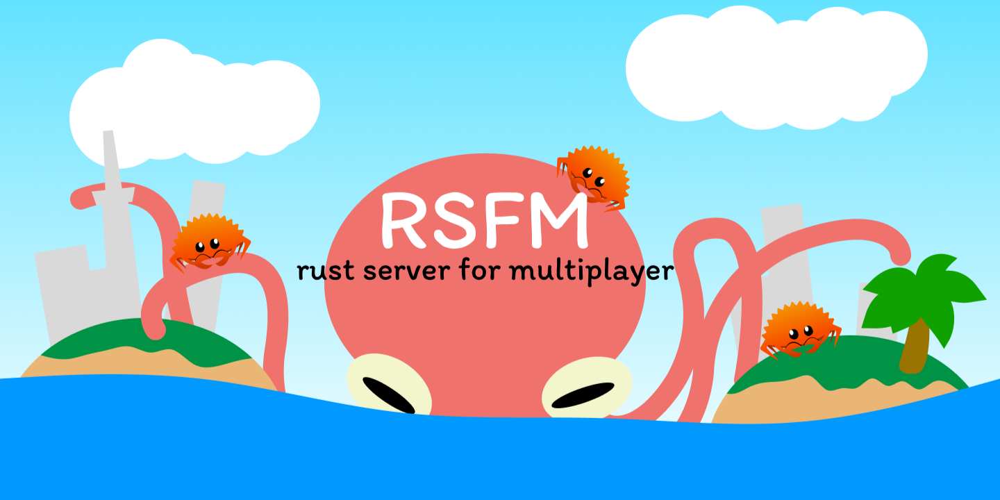

</img>

# rust-server-for-multiplayer
This is an SFU (Selectable Forwarding Unit) server for relaying [WebRTC](https://webrtc.org/?hl=en) and [WebSocket](https://developer.mozilla.org/en-US/docs/Web/API/WebSockets_API) packets. Intended for use in a realtime multiplayer game. This repository's webrtc implementation is mostly based on [binbat](https://github.com/binbat)'s [live777](https://github.com/binbat/live777) and [webrtc-rs](https://github.com/webrtc-rs/webrtc). 

> [!WARNING]  
> I am not a member or contributor of [original source](https://github.com/binbat/live777). Please note that my modification may have dropped original source's critical features. 

[sample unity project is here](https://github.com/TLabAltoh/Unity-SFU-Integration.git)

## Feature
- [x] ```Broadcast```
- [x] ```Unicast (by user id)```
- [ ] ```Multicast```
### WebRTC
- [x] ```DataChannel```
- [x] ```Audio```
- [x] ```Video```
- [x] ```Trickle-ICE```
- [ ] ```Vanilla-ICE (No plans at the moment.)```
### WebSocket
- [x] ```Binary```
- [ ] ```Text (No plans at the moment.)```
### Network Event (with ```user id```)
- [x] ```OnOpen```
- [x] ```OnClose```

## Overview
</img>

In this repository, you can use ```whep``` without ```whip``` in ```WebRTC```. When ```whep``` is called without ```whip```, the server prepares the dummy ```whip```. it assumes use cases for data streams that do not need an owner (like synchronising the transform of a gameobject and so on ...).

## Get Started

### Install
Clone this repository with the following command
```bat
git clone https://github.com/TLabAltoh/rust-server-for-multiplayer.git
```

### Build
```bat
cd REPOSITORY_ROOT
build-*.bat
```

### Run

```bat
cd REPOSITORY_ROOT
run-*.bat
```

### Client implementation Sample and Debug with browser
This repository contains a browser-based debugging tool. Prepare the media (```mp3``` and ```mp4```) of your choice and Run the command below to open it.

```bat
cd REPOSITORY_ROOT
mkdir assets\webui\media

@rem put the media (please set the name to sample-audio.mp3 and sample-video.mp4) of your choice. 

@rem ls
@rem sample-audio.mp3  sample-video.mp4
```

#### Chrome
```bat
cd REPOSITORY_ROOT
run-debug.bat

start chrome http://localhost:7777 --auto-open-devtools-for-tabs
```

#### Firefox
```bat
cd REPOSITORY_ROOT
run-debug.bat

start firefox http://localhost:7777 -devtools
```

Also, client implementation sample with ```javascript``` has been puted in ```./assets/webui/``` and used as part of ```debug-tool```'s module. Currently, it only has the function of just ```(join / exit) Room``` and ```(send / receive) MediaStream / DataChannel / WebSocket```. This repository only contains ```javascript``` client implementation examples. The ```C#``` version of the ```Unity``` client implementation example is maintained in a separate repository ([unity's sample is here !](https://github.com/TLabAltoh/Unity-SFU-Integration.git)).
